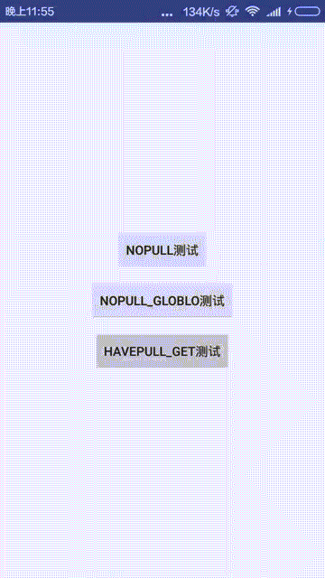

# Http_Rflist_Helper

A can network request and pullview Association, which does not need to handle page pull down animation processing and data update problem and global switch network request Libraries 

#### [中文版文档](./README-cn.md)

### Demo need to change the network API  and Local file （upload use）

### Solved problems 
- [x] Global switch network request Library 
- [x] May be associated with pullview association comes after animation flip characteristics and pull-up and pull-down will be automatically processed and the data will be updated automatically 
- [x] Global settings limitcolumn = "offsetcolumn", limit = "offset" field 
- [x] Error detection.Setmsgcheckcallback config for global settings return value 

### Jcenter

gradle

    compile 'com.zone:http-rflist-helper:1.0.3'

pom.xml

     <dependency>
       <groupId>com.zone</groupId>
       <artifactId>http-rflist-helper</artifactId>
       <version>1.0.3</version>
       <type>pom</type>
     </dependency>

# Preview

# Easy use:
1.Global switch network request Library 

      new Config().setGlobalEngine(ZhttpEngine.class);

2.request for initialization
     
     engineGet=new GlobalEngine(this, handler);//three params 's constructor  zhe three params is Open pop
	 //engineGet.setStartPage(1);//Set start page  
	 //handlerTag hander  Plus your own processing.  If you do not deal with it does not need to add handlertag 
     enginePost.sendFake(Net.post(UrlPath,new NetParams().setParamsMap(params)).handlerTag(POST_TAG));

3.It is not associated with the time when you want to perform this operation 

	engineGet.start();

4.Association pullview will automatically execute 
  
	googlePullView=new UltraPullView<MeiZiData.ResultsBean, MeiZiData>(swipe_container, rv) {
			@Override
			public List<MeiZiData.ResultsBean> getAdapterData(MeiZiData entity) {
				return entity.getResults();
			}
		};
	engineGet.relatePullView(googlePullView);

5.Association pullview will execute by myself ---firstPage
	 
	 engineGet.firstPage();
	 
Advanced operation and skills please see demo; 